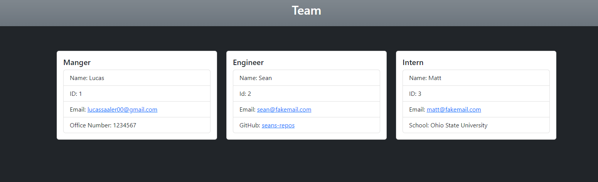

# Lucas-Saaler-Team-Profile-Generator

## Description

This application will allow the user to generate a website that displays the profiles of employees on their team.

## Table of Contents (Optional)

- [Installation](#installation)
- [Usage](#usage)
- [Credits](#credits)
- [License](#license)

## Installation

After downloading this program, run "npm i" in your terminal in order to install the required libraries.

## Usage

Run "node index" in the terminal, and you will be prompted with a series of questions. Answer them, and the appliction will generate your HTML file within the output folder. Currently there is a sample HTML in the applications folder, which will be overwritten by your file when you generate a new one.

Instructional video here: https://drive.google.com/file/d/1Mv_YGafkt8vwxLp7NS4YYp5tVNIHpktj/view?usp=sharing

This is an example of what a website this application will generate will look like:

## Credits

I coded this myself, using NodeJS and Inquirer. I also used Jest for testing the libraries I wrote.

## License

